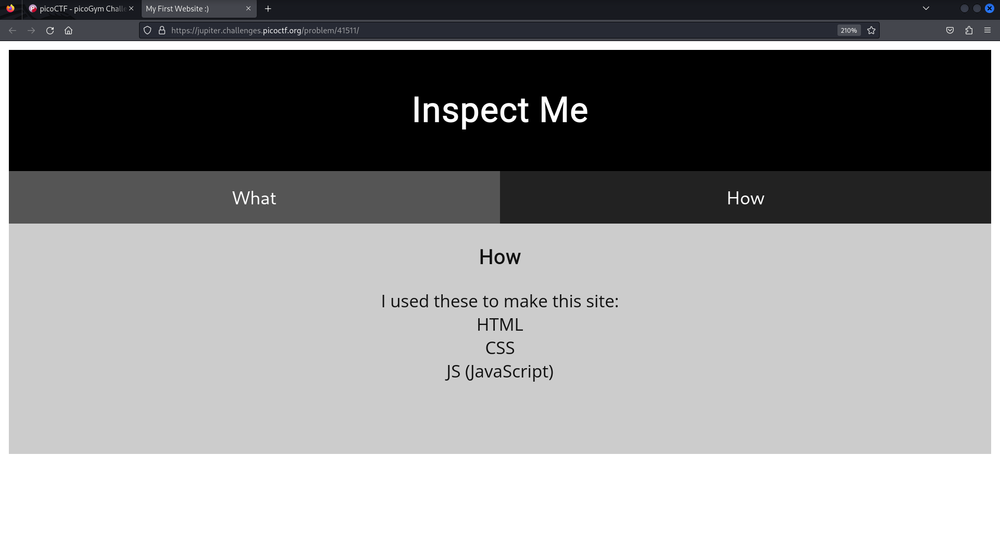
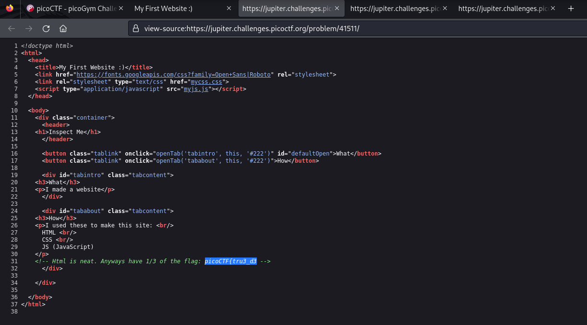
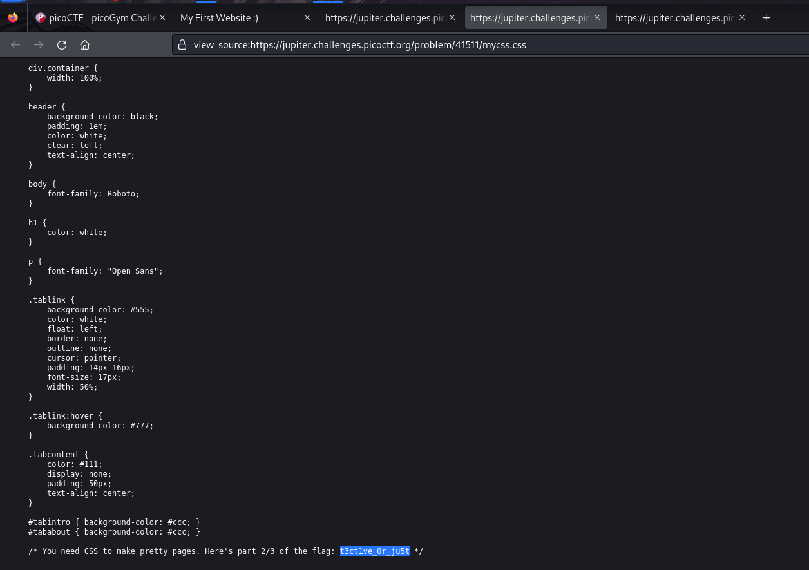
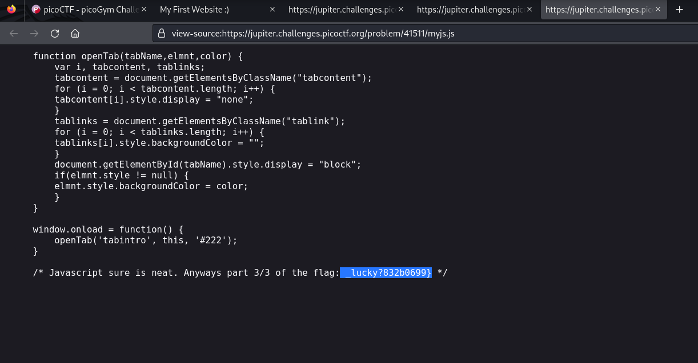

# Insp3ct0r

- Category: Web Exploitation
- Difficulty Level: Easy

### Introduction
We are provided with a website having two buttons and some texts. Pressing either of the buttons changes the background color of the website. The objective is to find the flag hidden somewhere.

### Approach
I glanced at the website text, to see if the flag or any part of it has been placed without concealing. Next I view the source code. The source has a part of the flag, a javascript file and a css file.

I found that the javascript file has another part of the flag. 

It became obvious at this point that the text on the website is a hint to the where the files are hidden. `I used these to make the website: HTML CSS Js`. Pointing out that the next part of the flag might be in the css flag.

Merging the 3 parts gives us the flag `picoCTF{tru3_d3t3ct1ve_0r_ju5t_lucky?832b0699}`

### Learning Outcome
- A website's source code is the first place for look for information. Not only does this give us the workings of the website but may reveal information about any potential ways to get more information from the website.
