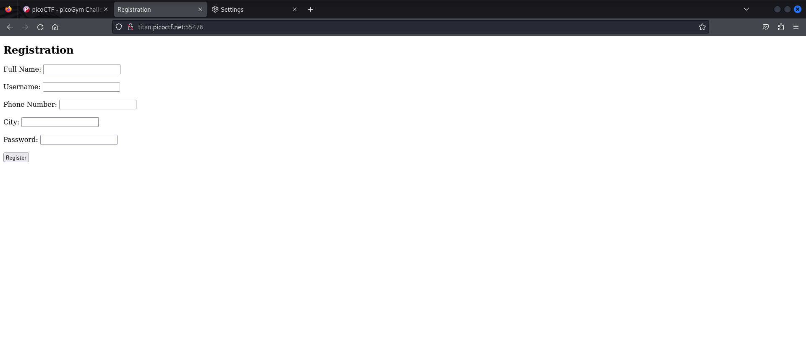
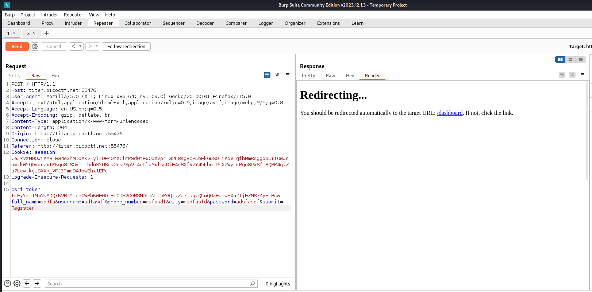
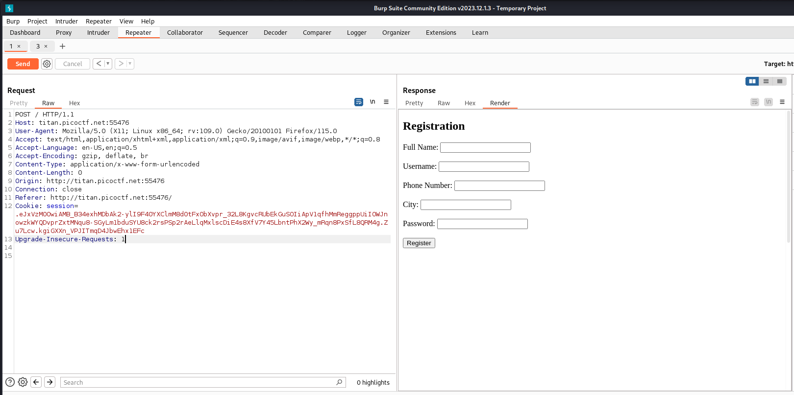
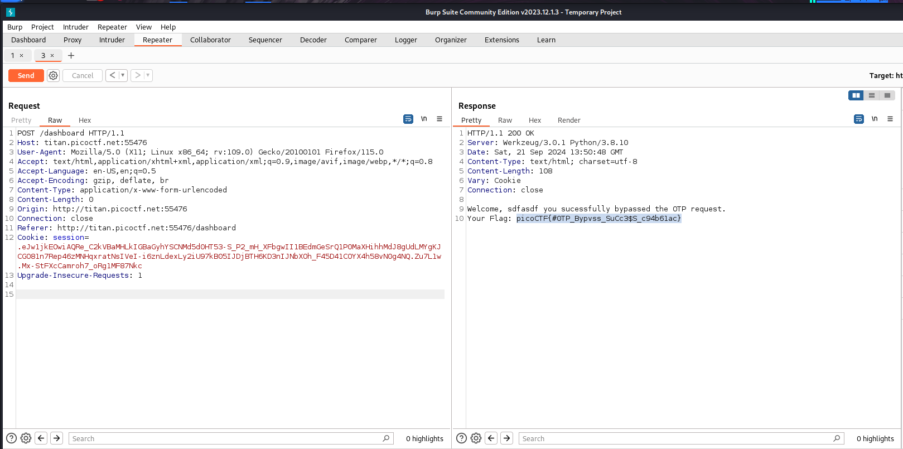

# IntroToBurp

- Category: Web Exploitation
- Level: Easy
### Introduction
We are given a website that has several fields, all of which are mandatory to be led into the following page which asks for an OTP.

### Approach
I started with viewing the source code to find any parts of the flag or files that lead me to a page or give some form of information. As the title suggest "IntroToBurp", I started analysing the way client made requests to the website via Burp proxy. Next I filled the mandatory fields with unusual data such as Numbers for username, symbols for phone number etc.

When this did not work, I sent GET, POST & HEAD requests to both pages,sometimes paried with random texts to trigger unusual responses from the website. I had to view a hint at this point as I was getting nowhere. The hint was `Try mangling the request, maybe their server-side code doesn't handle malformed requests very well.`

Now I started sending gibberish texts, deleted fields & requesting files that do not exist.

The main page did not yield any result as there is server side check validating that all inputs are present.
But the OTP page gives us the flag when OTP field was deleted in the normal POST request.

### Learning Outcome
- Websites are not perfect, outdated components and unsecure plugins may cause them to behave abrnormally when faced with unusual request payloads that can potentially compromise the CIA of the website.
- Mangling HTTP responses involves testing which fields or parts of a payload are not validated on the server side and tinkering them to trigger unusual responses.
