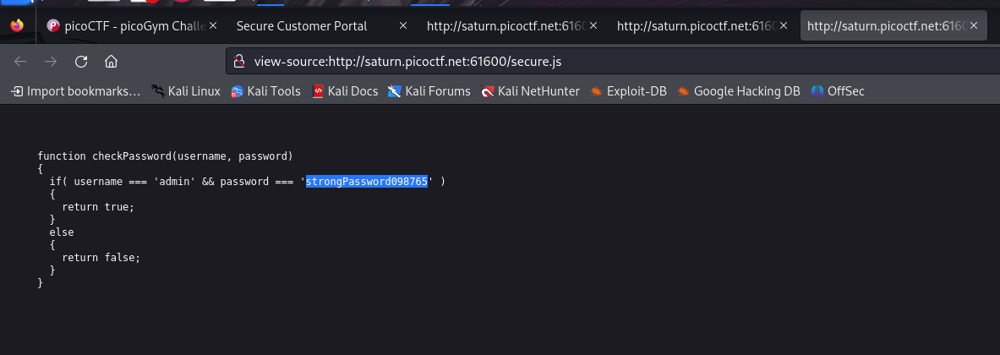

# Local Authority

- Category: Web Exploitation
- Difficulty level: Easy

### Introduction
We are provided with a website that has a Username & Password field.

### Approach
I inspected the source code where I found a login.php file.

The login.php file had an admin.php file and a hash value which I will use later if there are no leads.

The admin.php had both the administrator username and password, allowing us access into the website.

Logging into the website gives us the flag.

### Learning Outcomes
- This exploitation was possible only because the website verified users via a code on the client side.
- An unsafe way of verifying users will compromise the confidentiality of the website and may escalate into integrity & availability issues if the account has necessary privileges.
