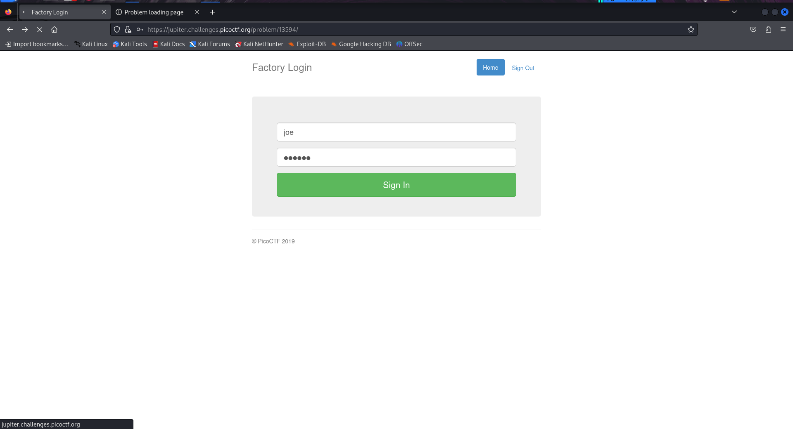
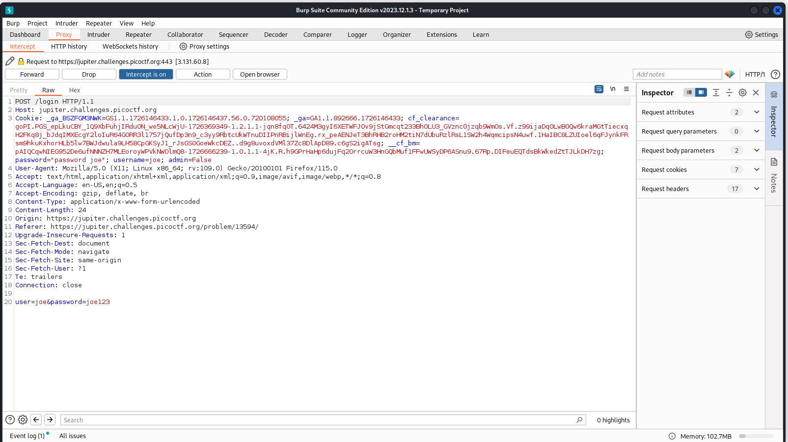
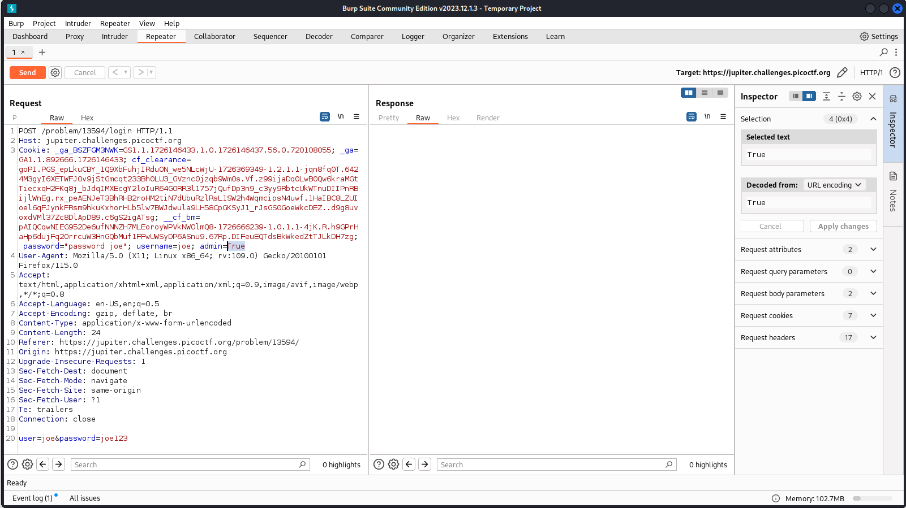
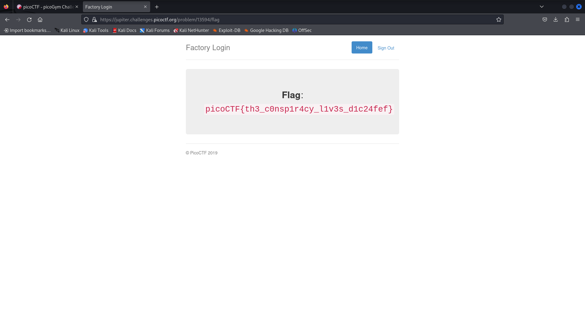

# Logon

- Category: Web exploitation
- Difficulty Level: Easy

### Introduction
We are provided with a website asking for username & password field. The website has been hiding things from all its users and we as user 'Joe' need to find what's been hidden.

### Approach
I first take a look at the source code of the website for any hidden files or information. Then I tried some of the common usernames and passwords like (root,root)(admin,admin)...and so on.
Before going any further and performing a brute force attack, I viewed the requests and responses on burp suite.

After several attempts at mangling requests. I noticed an `admin=false` field in the cookies. I sent the packet again but with `admin` set as `True`& it gave me the flag.

### Learning Outcome
- Cookies can often be misused, if the server owners are not careful to only include what is necessary.
