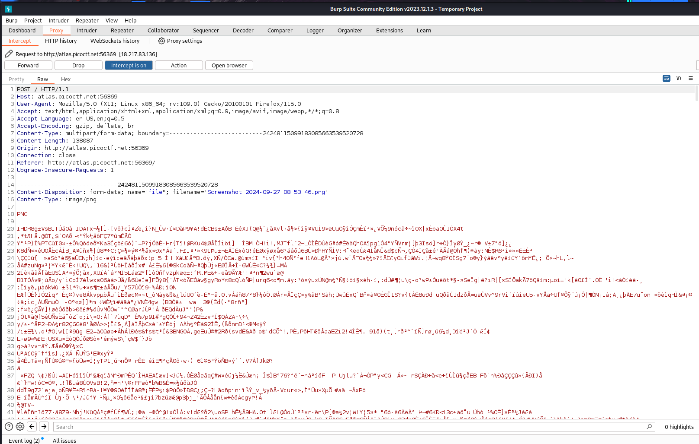
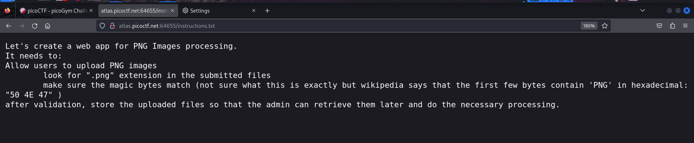

# Trickster

- Category: Web Exploitation
- Difficulty Level: Medium

### Introduction
We are provided with a website that takes in Images. The objective is to find a flag hidden somewhere accessible through this website.

The website only takes in Png images or a message is shown.

### Approach
As always I start with the source code which had nothing. So I started to mangle http requests sent to trigger some form of response that I could work on.

This too did not lead me anywhere, so I started to find any hidden directories by trying common directory names.  helped me here.
I found an uploads directory but had no permission.

Then I remembered to check for a robots.txt which was a good lead to start on. A step which I should have done earlier and saved some time.

As stated in the instruction.txt, the website only checks for "PNG" in the file name, verifies it by check for magic bytes and a "PNG" at the beginning of files we sent. So we will now attempt to smuggle a php file
and get a reverse shell. The reverse shell will traverse all directories and get us the flag.

The file name has a "PNG" but is actually a .php, we also have "PNG" and magic bytes at the start of the payload.
*Note:You could skip the html part and make the payload smaller, but give inputs in the url which I wanted to avoid, hence a html page.*

We do not have permission to the 'Uploads' directory, but can get the php file by adding its name in the url. This gives us a html page that servers as our reverse shell.

As you can see, the "cd" command does not work because we are not allowed to traverse to that directory. Instead of traversing directories, I will try to use the "find" command and look for common file types that might have the flag.
I start wtih txt files as those are most easiest places for a flag to be hidden.

There is a txt that seems unusual and it had our flag

### Learning Outcomes
- This vulnerability exists because the website did not validate its input. File types can be spoofed but we could avoid this by checking for the uploaded file's MIME type or getting the image's dimensions.
- Exploiting vulnerabilities isn't always very straight and simple. We need to think outside the box on how limited permissions can still be exploited to get what an attacker wants.
