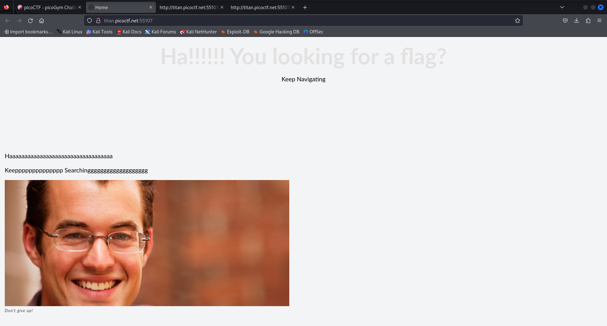
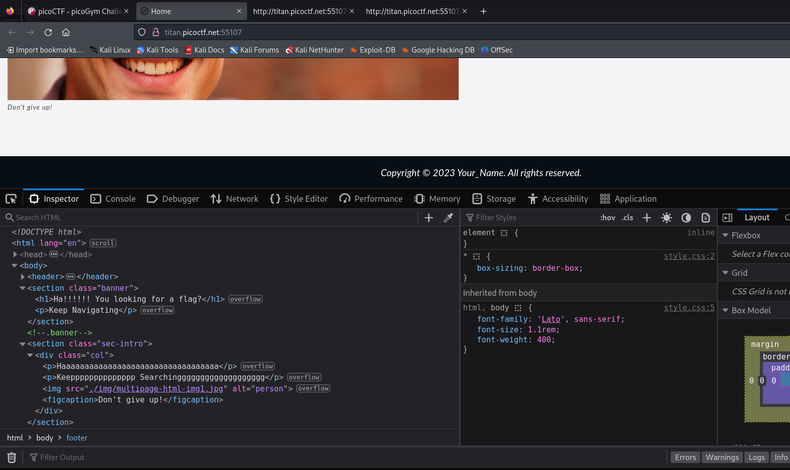
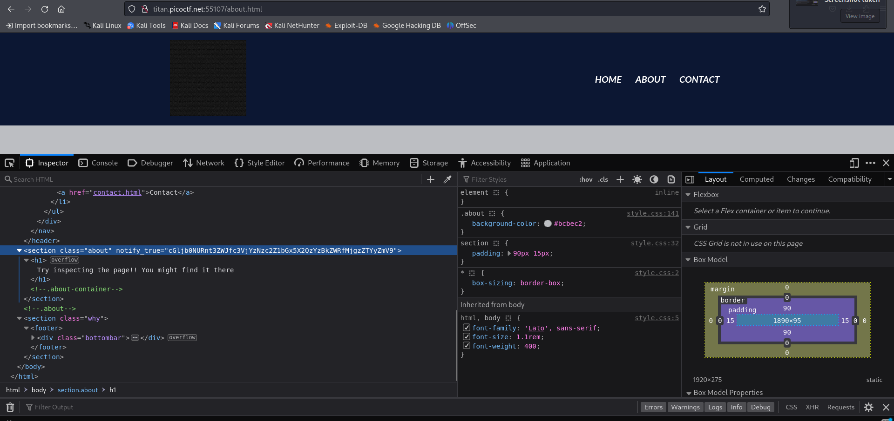
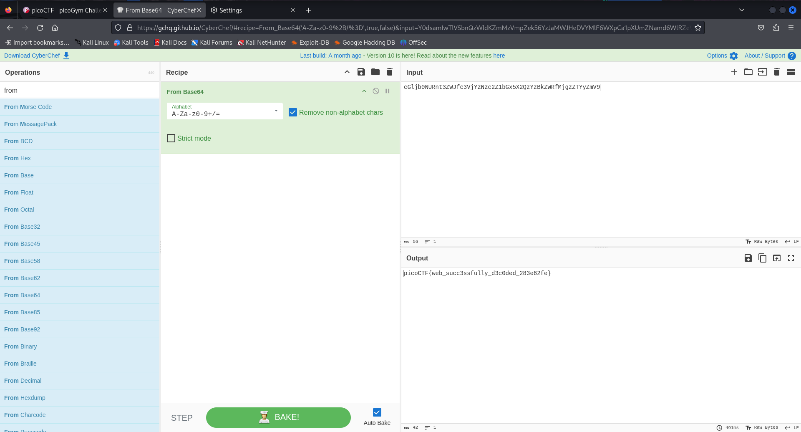

# Web Decode

- Category: Web Exploitation
- Difficulty Level: Easy

### Introduction
We are given a website that has a flag hidden somewhere, the website has a few pages and some text information.

### Approach
I see if there are any hints in the main page and then move on to the source code. There was nothing here so I start checking the other pages

Upon viewing the "About me" page, there was a hint about the a lead being present in the source code. The source code had some encrypted text and no other leads.

I used cyberchef and tried decoding it using the algorithms available. Surely it was a base64 encoded text.

### Learning Outcome
- Websites often have information that are encoded by hasing or some other cryptographic method to hide it from malicious use.
- However most of the older cryptographic algorithms have been cracked repeatedly, posing a risk. So information as such must be avoided from being displayed publically.
