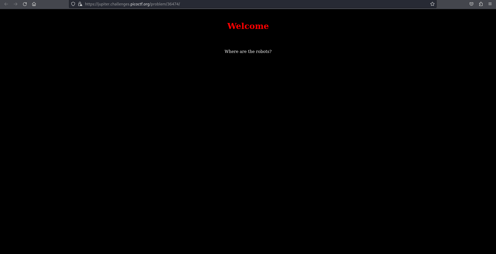
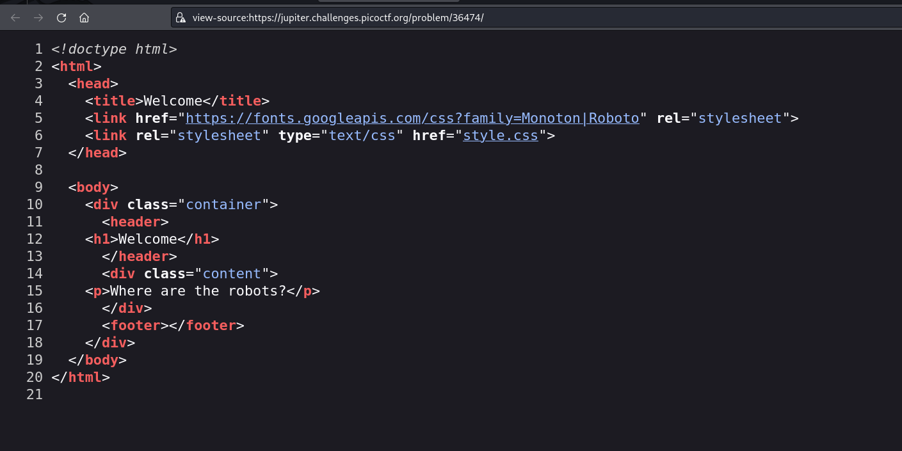
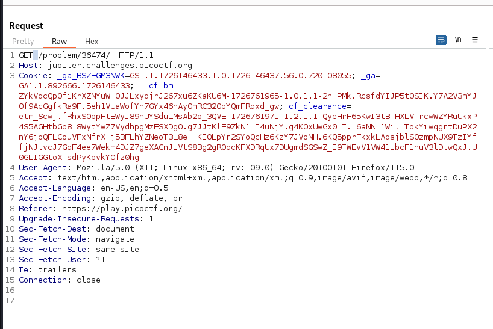
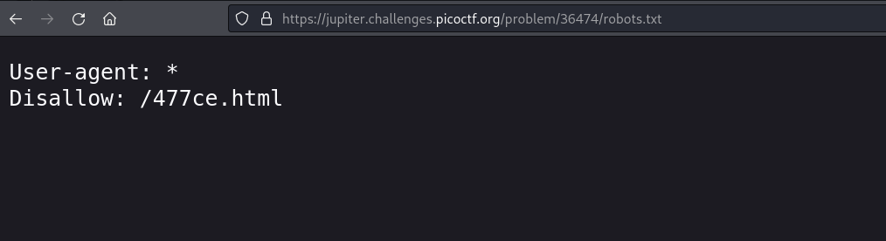
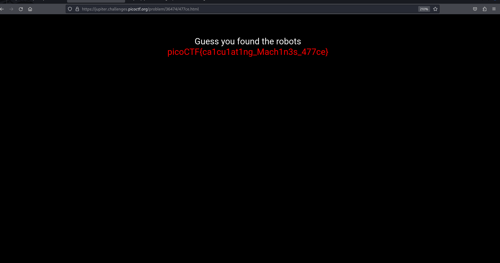

# Where are the Robots

- Category: Web exploitation
- Difficulty level: Easy

### Introduction
We are provided with a website that only has a text message *"Where are the robots?"*. The objective is to find a flag hidden somewhere within the website.

### Approach
I start with viewing the source code to see if there are any pages, links or buttons hidden. There were no leads here.

Next I view the requests and responses of the website. Here I tried to mangle the request but had limited option as there weren't many fields.

After several attempts to trigger an unusual response. I viewed a hint and it said ,*"What part of the website could tell you where the creator doesn't want you to look?"*.

I will still clueless and upon some research find out that websites also host a `robots.txt` file for the directories that it doesn't want to crawled and indexed by spiders. Users can still acess the webpages by stating the directories explicitly

The `robots.txt` had the path to a page which gave me the flag.

### Learning Outcome
- A website may not have all its pages indexed and publicly available. The `robot.txt` sometimes may not list some webpages as users now know to look for it here.
- These hidden pages & directories can be viewed with other tools such as dirb or burpsuite. This is called URL fuzzing which involves sending permuted inputs & examining the outputs to spot security flaws in a website.
