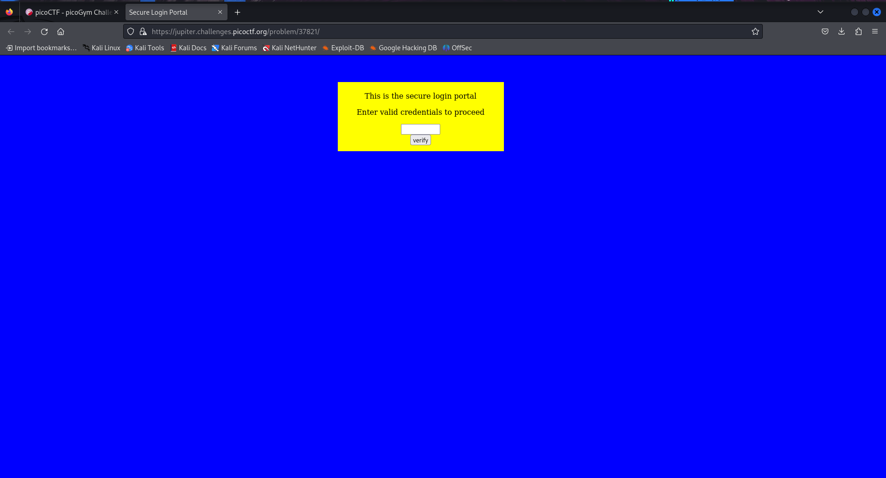
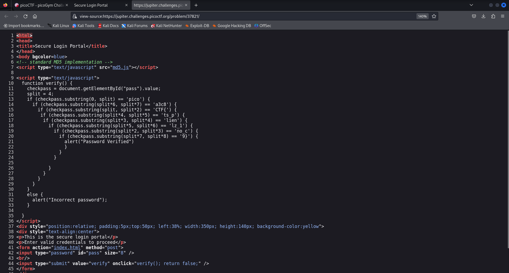
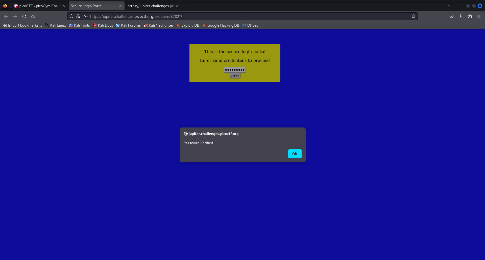

# dont_use_client_side
 
 - Category: Web Exploitation
 - Difficulty Level: Easy

### Introduction

We are provided with a website taking only a password field as input.

### Approach
Since there is only one field, we will try finding leads in the source code, request and responses.
The source code seems to have a piece of code that validates the password entered. It seems the website owners have tried to conceal this piece of code very poorly.

Upon rearranging it, we get our flag.

However, we still need to verify if its the real flag by logging in. 

And it has granted us access into the website.

### Learning Outcome
- Passwords even unhashed must never be validated on the client side as it compromises the confidentiality of users and can escalate to integrity and accessibility issues with the right privileges
- Due to infrastructure constraints or other reasons unknown, the owners have poorly concealed a part of code. But threat actor have both the time and tools to find flaws in codes.
- Client side code must never contain information that can serve as an exploit or be a disadvantage to the website owners.
