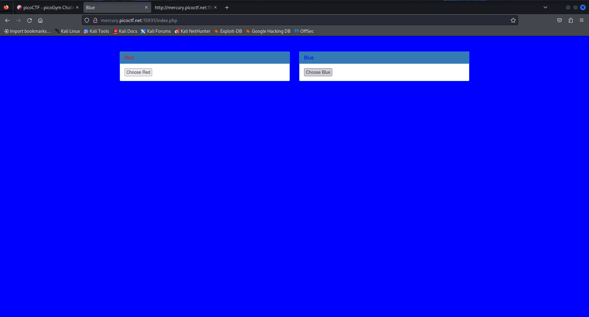
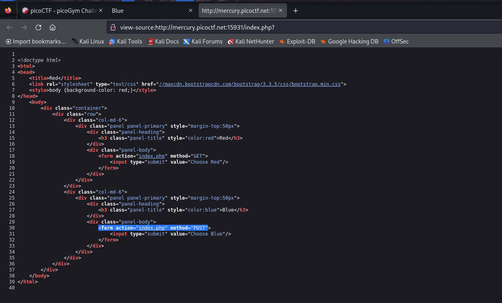
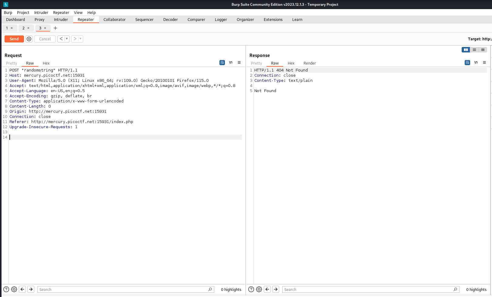
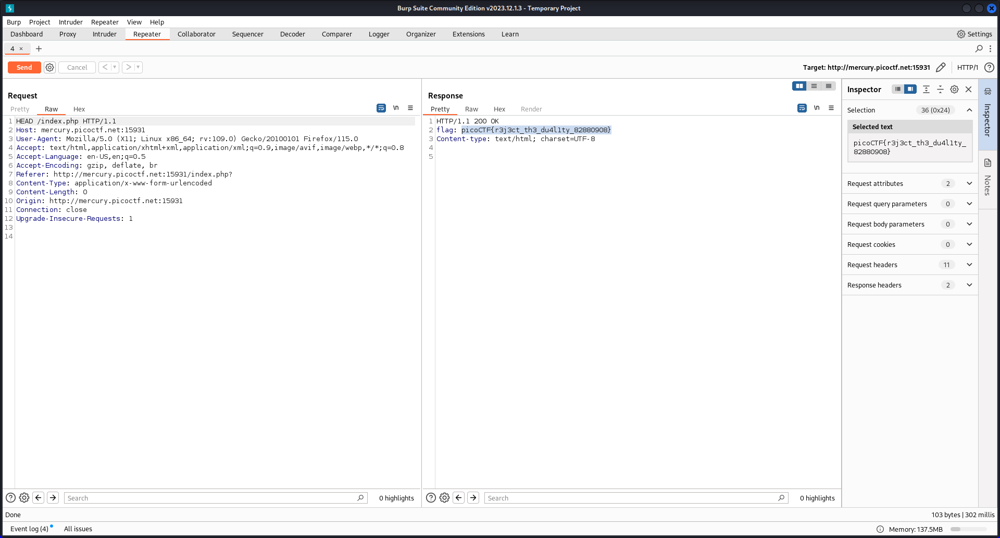

# GET aHEAD

- Category: Web Exploitation
- Difficulty Level: Easy

### Introduction
We are given a website with two buttons, when pressed, change the background color of the website to what the text on the button states.

### Approach
We will start viewing the source code of the website first, then check the requests & responses for any leads.
Upon inspecting the source code of the website, I notice that the buttons simply send a POST and GET request to the server. There is no other piece of code.

I tried mangling the HTTP request by sending random strings to trigger an unusual response, but that did not work either. We do not have any other fields to mangle the HTTP request. I was lost at this point and viewed a hint.

The hint said `Maybe you have more than 2 choices`. So I sent a HTTP request with the 3rd choice I had, as the title of the challenge says i.e., a HEAD request. This gave me the flag I wanted.

### Learning Outcome
- Mangling requests does not involve only tinkering with the available input fields, sometimes we have to think outside the box.
- Although the HEAD request does not give much information on modern websites, but a poorly made website using unsecure plugins can give out information that the owner did not intend to, giving attackers some advantage.

